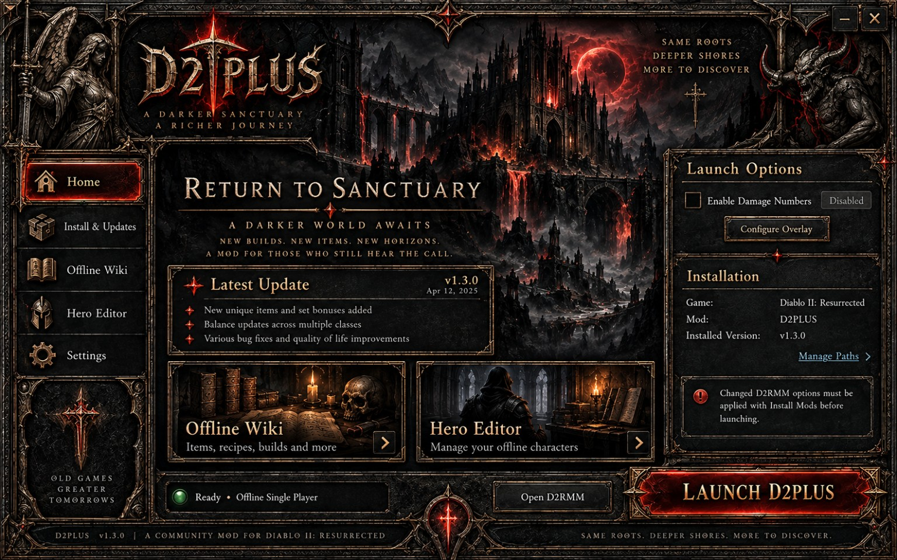

# D2PLUS Launcher — Alpha 0.0.2

**Same roots. Deeper shores. More to discover.**

A Windows desktop home for your offline D2PLUS setup: game launching, offline wiki, hero editor and optional floating damage numbers.



*Design reference, not a captured Windows test. Live labels show Alpha 0.0.2; setup panels differ.*

## Release status

**Alpha test build.** The release tag is `v0.0.2-alpha`. This label replaces the previous internal launcher label `0.2.0`; it does not downgrade or renumber your D2PLUS mod or wiki.

The GitHub release is being prepared in [D2Plus-D2R/D2PLUS-Launcher](https://github.com/D2Plus-D2R/D2PLUS-Launcher). After publication, use the repository's **Releases** section to obtain:

- `D2PLUS_Launcher_Setup_0.0.2-alpha.exe` — recommended Windows installer.
- `D2PLUS_Launcher_Portable_0.0.2-alpha.zip` — extract all files, then open `D2PLUS Launcher.exe`.
- `D2PLUS_GitHub_Alpha_0.0.2.zip` — launcher source, repository documentation and GitHub Pages site.
- `SHA256SUMS-0.0.2-alpha.txt` — file integrity hashes.

Do not move the portable EXE away from its DLLs and resources. No separate Node.js installation is required to use the packaged application.

## What it does

- Opens a D2PLUS-themed desktop window based on the supplied reference artwork.
- Guides you through game, mod and companion paths on first use.
- Imports your working Windows shortcut and preserves extra launch arguments.
- Uses the mod files already installed by D2RMM; it does not silently reinstall mods.
- Opens the offline wiki and hero editor in their own application windows.
- Offers damage numbers as a persistent option, off by default for new settings.
- Matches the configured D2R installation, prevents duplicate managed launches and handles game exit.
- Provides a verified D2RMM download option and clear component status.

This launcher bundle does **not** include the full D2PLUS D2RMM mod or the game. Use your existing working mod installation. A public D2PLUS mod update feed is not yet configured.

## First setup

1. Close the old Offline Suite console; both launchers use local port 8080.
2. Run the installer and open the **D2PLUS Launcher** desktop shortcut.
3. Import your known-working `.lnk` shortcut, or select `D2R.exe`, the installed mod output folder and complete launch arguments.
4. Verify the mod output name and arguments. Keeping the correct output name matters for finding your existing saves.
5. If you changed D2RMM options, click **Install Mods** in D2RMM before launching.
6. Test offline D2PLUS with damage numbers off first. Enable them after confirming the game works.

The installer uses `%LOCALAPPDATA%\Programs\D2PLUS Launcher`. Launcher settings remain at `%LOCALAPPDATA%\D2PLUS\OfflineSuite\settings.json`.

## Damage numbers

The bundled source-built companion is based on [Fr4nsson/D2RDamageNumbers](https://github.com/Fr4nsson/D2RDamageNumbers). Original memory/compatibility checks remain active; no offsets were invented. Exact D2R compatibility has not been verified here.

Use offline single-player in windowed or borderless mode. First-run positioning can require hovering over several monsters. Configure the optional DPS display so it avoids the Practical HUD.

The overlay measures **monster health loss**. Rapid hits, mercenaries and summons may be combined. It is not a precise player-only DPS meter or a confirmed critical-strike detector. A companion error does not prevent the wiki, editor or game from opening.

## Testing and limitations

- 22 automated launcher, setup, persistence and desktop-shell tests passed for this renamed release. Page navigation, draft download buttons and published tag-specific links were also checked.
- Windows executable structure and package integrity are checked during packaging.
- No live Windows installer, D2R, overlay accuracy or display-scaling test has been performed in this environment.
- Installer is unsigned.
- Browser-based wiki notes/favorites do not automatically migrate to the desktop app's separate profile; use the wiki's backup export/import.
- The installer preserves game files, saves and launcher settings. Export editor changes before closing the launcher.

See [release notes](release-notes/v0.0.2-alpha.md), [full setup instructions](README-DESKTOP.txt) and [publishing instructions](PUBLISHING.md).

## Source and development

`desktop/` contains the Electron shell; `scripts/` the Windows launcher backend; `docs/launcher/` the launcher interface. The unchanged compiled wiki/editor are stored in `vendor/offline-suite.zip.part*` and unpacked into `docs/` for development and packaging. `companion/` contains the companion binary, source, patch and notices.

The GitHub Pages marketing page is isolated under `site/`; the publishing workflow uploads only the generated `_site/` folder. It does not expose the backend or your settings.

```sh
python3 build/unpack-suite.py
npm install
npm test
npm run test:ui
python3 build/site.py
```

To package Windows x64 files, use `python3 build/package.py --makensis /path/to/makensis`. It downloads the pinned Electron archive, verifies its recorded SHA-256 and builds the portable package and installer. Python 3 and NSIS are build requirements. Electron is needed separately only when using `npm start` for development.

## Credits and rights

Thanks to Fr4nsson for D2RDamageNumbers; dschu012 for d2s-editor and d2s; TrayHard for d2r-saver; Sappho for Trading Market source material credited by the wiki; and the Electron, Bootstrap, Bootswatch, jQuery and Popper projects.

Existing MIT/OFL and other notices are retained in [THIRD_PARTY_NOTICES.md](THIRD_PARTY_NOTICES.md), `licenses/`, and `companion/notices/`. The root MIT license originates from the inherited hero editor. It is **not** a blanket license for Blizzard artwork or every bundled asset. See [public release review](PUBLIC-RELEASE-REVIEW.md) before publishing the full bundle.

D2PLUS is an unofficial fan project, not affiliated with or endorsed by Blizzard Entertainment. Diablo II and Diablo II: Resurrected belong to their respective owners.

## Repository setup

The repository is private. The page is prepared but not deployed. Run the manual **Build alpha packages** workflow to create a draft prerelease with installer, portable ZIP and checksums. It does not publish the draft. Keep the page download buttons disabled until a public release exists.
